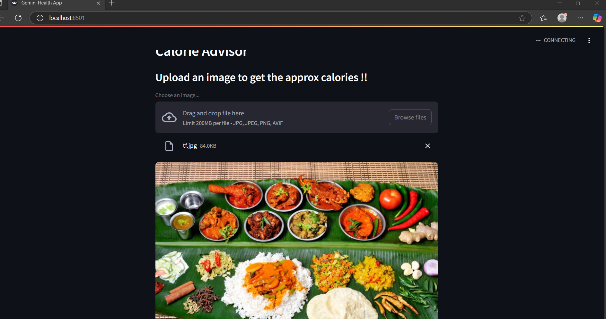
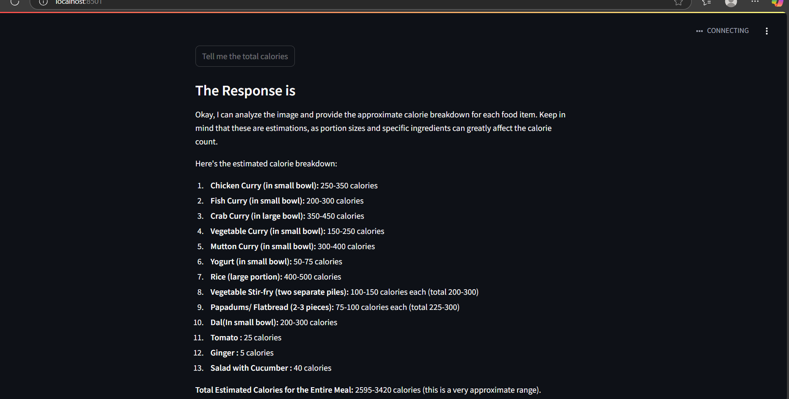

### CalorieAdvisor

#### Project Overview
This project is the basic LLM app using gemini api to calculate the calories of the food items from the input image and gives the total calories and individual calorie of the food item.

#### Demo
Following image is given as the input

---------------

#### Output

----------------

